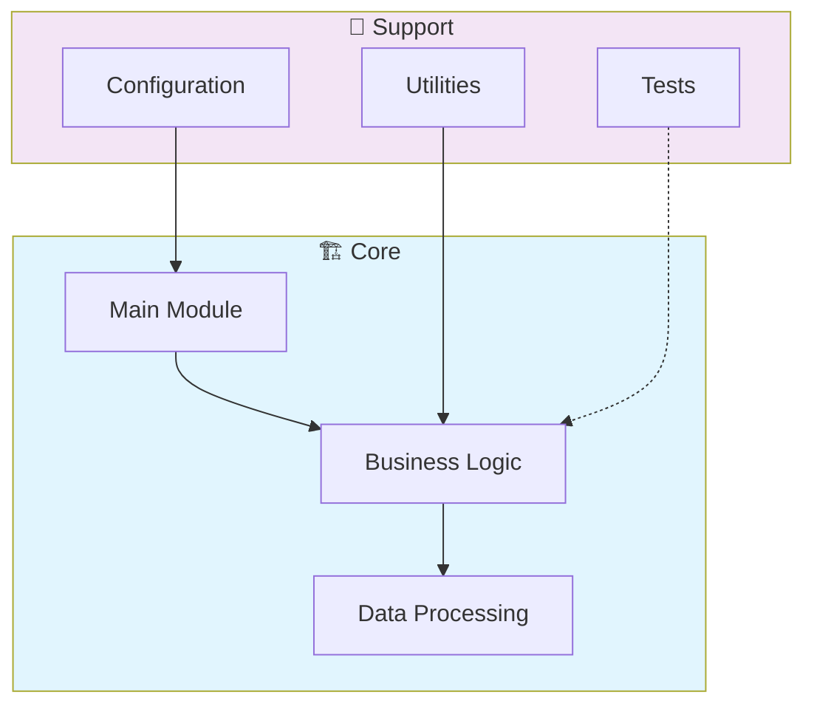

# 🤖 Explorando Os Recursos De Ia Generativa Com Copilot E Openai

> Professional Unknown project implementing Explorando Os Recursos De Ia Generativa Com Copilot E Openai

[](LICENSE)

[English](#english) | [Português](#português)

---

## English

### 🎯 Overview

**Explorando Os Recursos De Ia Generativa Com Copilot E Openai** is a production-grade Unknown application that showcases modern software engineering practices including clean architecture, comprehensive testing, containerized deployment, and CI/CD readiness.

The codebase comprises **0 lines** of source code organized across **0 modules**, following industry best practices for maintainability, scalability, and code quality.

### ✨ Key Features

- **🤖 ML Pipeline**: End-to-end machine learning workflow from data to deployment
- **🔬 Feature Engineering**: Automated feature extraction and transformation
- **📊 Model Evaluation**: Comprehensive metrics and cross-validation
- **🚀 Model Serving**: Production-ready prediction API

### 🏗️ Architecture



### 🚀 Quick Start

#### Prerequisites

#### Installation

```bash
git clone https://github.com/galafis/Explorando-os-Recursos-de-IA-Generativa-com-Copilot-e-OpenAI.git
cd Explorando-os-Recursos-de-IA-Generativa-com-Copilot-e-OpenAI
```

### 📁 Project Structure

```
Explorando-os-Recursos-de-IA-Generativa-com-Copilot-e-OpenAI/
├── LICENSE
└── README.md
```

### 🛠️ Tech Stack

| Technology | Description | Role |
|------------|-------------|------|

### 🤝 Contributing

Contributions are welcome! Please feel free to submit a Pull Request. For major changes, please open an issue first to discuss what you would like to change.

1. Fork the project
2. Create your feature branch (`git checkout -b feature/AmazingFeature`)
3. Commit your changes (`git commit -m 'Add some AmazingFeature'`)
4. Push to the branch (`git push origin feature/AmazingFeature`)
5. Open a Pull Request

### 📄 License

This project is licensed under the MIT License - see the [LICENSE](LICENSE) file for details.

### 👤 Author

**Gabriel Demetrios Lafis**
- GitHub: [@galafis](https://github.com/galafis)
- LinkedIn: [Gabriel Demetrios Lafis](https://linkedin.com/in/gabriel-demetrios-lafis)

---

## Português

### 🎯 Visão Geral

**Explorando Os Recursos De Ia Generativa Com Copilot E Openai** é uma aplicação Unknown de nível profissional que demonstra práticas modernas de engenharia de software, incluindo arquitetura limpa, testes abrangentes, implantação containerizada e prontidão para CI/CD.

A base de código compreende **0 linhas** de código-fonte organizadas em **0 módulos**, seguindo as melhores práticas do setor para manutenibilidade, escalabilidade e qualidade de código.

### ✨ Funcionalidades Principais

- **🤖 ML Pipeline**: End-to-end machine learning workflow from data to deployment
- **🔬 Feature Engineering**: Automated feature extraction and transformation
- **📊 Model Evaluation**: Comprehensive metrics and cross-validation
- **🚀 Model Serving**: Production-ready prediction API

### 🏗️ Arquitetura


### 🚀 Início Rápido

#### Prerequisites

#### Installation

```bash
git clone https://github.com/galafis/Explorando-os-Recursos-de-IA-Generativa-com-Copilot-e-OpenAI.git
cd Explorando-os-Recursos-de-IA-Generativa-com-Copilot-e-OpenAI
```

### 📁 Estrutura do Projeto

```
Explorando-os-Recursos-de-IA-Generativa-com-Copilot-e-OpenAI/
├── LICENSE
└── README.md
```

### 🛠️ Stack Tecnológica

| Tecnologia | Descrição | Papel |
|------------|-----------|-------|

### 🤝 Contribuindo

Contribuições são bem-vindas! Sinta-se à vontade para enviar um Pull Request.

### 📄 Licença

Este projeto está licenciado sob a Licença MIT - veja o arquivo [LICENSE](LICENSE) para detalhes.

### 👤 Autor

**Gabriel Demetrios Lafis**
- GitHub: [@galafis](https://github.com/galafis)
- LinkedIn: [Gabriel Demetrios Lafis](https://linkedin.com/in/gabriel-demetrios-lafis)
