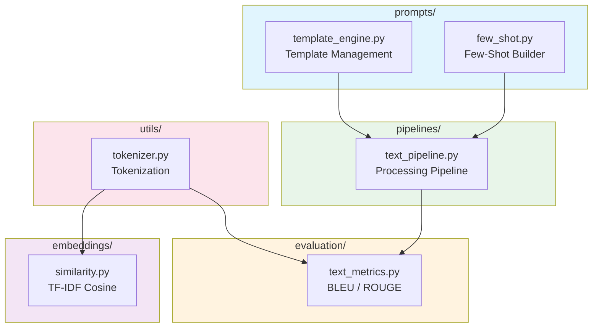
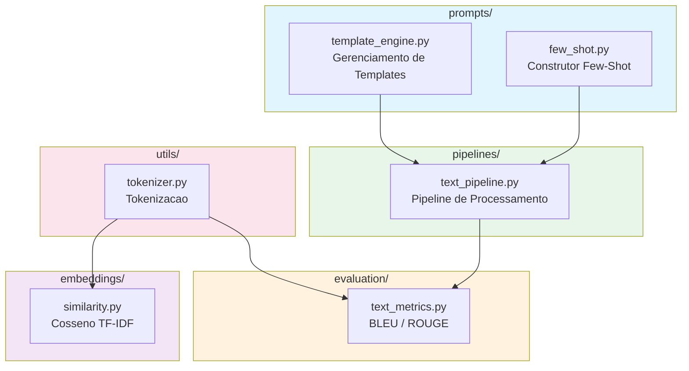

# Generative Text Exploration Toolkit

> DIO - Exploring Generative Resources


[English](#english) | [Portugues](#portugues)

---

## English

### Overview

**Generative Text Exploration Toolkit** is a Python framework for exploring generative text capabilities through prompt engineering, text processing pipelines, evaluation metrics, and text similarity analysis. The project implements core NLP concepts from scratch without external ML dependencies.

The codebase comprises **1,200+** lines of source code organized across **6 modules**, covering prompt management, text generation pipelines, BLEU/ROUGE evaluation, TF-IDF similarity, and tokenization utilities.

### Key Features

- **Prompt Template Engine**: Variable injection with defaults, template registry, and validation
- **Few-Shot Builder**: Configurable few-shot prompt construction with chat format support
- **Text Pipeline**: Modular text processing pipeline with mock generation
- **Evaluation Metrics**: BLEU score, ROUGE-N, and ROUGE-L implementations
- **Text Similarity**: TF-IDF cosine similarity with corpus management and querying
- **Tokenizer**: Whitespace tokenizer with stopwords, vocabulary building, and encoding

### Architecture


```mermaid
graph TB
    subgraph Prompts["prompts/"]
        A[template_engine.py<br>Template Management]
        B[few_shot.py<br>Few-Shot Builder]
    end

    subgraph Pipeline["pipelines/"]
        C[text_pipeline.py<br>Processing Pipeline]
    end

    subgraph Eval["evaluation/"]
        D[text_metrics.py<br>BLEU / ROUGE]
    end

    subgraph Embed["embeddings/"]
        E[similarity.py<br>TF-IDF Cosine]
    end

    subgraph Utils["utils/"]
        F[tokenizer.py<br>Tokenization]
    end

    A --> C
    B --> C
    C --> D
    F --> E
    F --> D

    style Prompts fill:#e1f5fe
    style Pipeline fill:#e8f5e9
    style Eval fill:#fff3e0
    style Embed fill:#f3e5f5
    style Utils fill:#fce4ec
```

### Quick Start

#### Prerequisites

- Python 3.9+
- pip

#### Installation

```bash
git clone https://github.com/galafis/Explorando-os-Recursos-de-IA-Generativa-com-Copilot-e-OpenAI.git
cd Explorando-os-Recursos-de-IA-Generativa-com-Copilot-e-OpenAI
pip install -r requirements.txt
```

#### Usage

```bash
python main.py
pytest tests/ -v
```

### Project Structure

```
Explorando-os-Recursos-de-IA-Generativa-com-Copilot-e-OpenAI/
├── main.py
├── requirements.txt
├── src/
│   ├── prompts/
│   │   ├── template_engine.py
│   │   └── few_shot.py
│   ├── pipelines/
│   │   └── text_pipeline.py
│   ├── evaluation/
│   │   └── text_metrics.py
│   ├── embeddings/
│   │   └── similarity.py
│   └── utils/
│       └── tokenizer.py
├── tests/
│   ├── test_prompts.py
│   └── test_metrics.py
├── LICENSE
└── README.md
```

### Tech Stack

| Technology | Description         | Role              |
|-----------|---------------------|-------------------|
| Python    | Programming language | Core runtime      |
| Pytest    | Testing framework    | Unit testing      |

### License

This project is licensed under the MIT License - see the [LICENSE](LICENSE) file for details.

### Author

**Gabriel Demetrios Lafis**
- GitHub: [@galafis](https://github.com/galafis)
- LinkedIn: [Gabriel Demetrios Lafis](https://linkedin.com/in/gabriel-demetrios-lafis)

---

## Portugues

### Visao Geral

**Generative Text Exploration Toolkit** e um framework Python para explorar capacidades de texto generativo atraves de engenharia de prompts, pipelines de processamento de texto, metricas de avaliacao e analise de similaridade textual. O projeto implementa conceitos fundamentais de NLP do zero, sem dependencias externas de ML.

A base de codigo compreende **1.200+** linhas de codigo-fonte organizadas em **6 modulos**, cobrindo gerenciamento de prompts, pipelines de geracao de texto, avaliacao BLEU/ROUGE, similaridade TF-IDF e utilitarios de tokenizacao.

### Funcionalidades Principais

- **Motor de Templates de Prompt**: Injecao de variaveis com valores padrao, registro de templates e validacao
- **Construtor Few-Shot**: Construcao configuravel de prompts few-shot com suporte a formato de chat
- **Pipeline de Texto**: Pipeline modular de processamento de texto com geracao simulada
- **Metricas de Avaliacao**: Implementacoes de BLEU score, ROUGE-N e ROUGE-L
- **Similaridade de Texto**: Similaridade por cosseno TF-IDF com gerenciamento de corpus e consultas
- **Tokenizador**: Tokenizador por espacos com stopwords, construcao de vocabulario e codificacao

### Arquitetura


```mermaid
graph TB
    subgraph Prompts["prompts/"]
        A[template_engine.py<br>Gerenciamento de Templates]
        B[few_shot.py<br>Construtor Few-Shot]
    end

    subgraph Pipeline["pipelines/"]
        C[text_pipeline.py<br>Pipeline de Processamento]
    end

    subgraph Eval["evaluation/"]
        D[text_metrics.py<br>BLEU / ROUGE]
    end

    subgraph Embed["embeddings/"]
        E[similarity.py<br>Cosseno TF-IDF]
    end

    subgraph Utils["utils/"]
        F[tokenizer.py<br>Tokenizacao]
    end

    A --> C
    B --> C
    C --> D
    F --> E
    F --> D

    style Prompts fill:#e1f5fe
    style Pipeline fill:#e8f5e9
    style Eval fill:#fff3e0
    style Embed fill:#f3e5f5
    style Utils fill:#fce4ec
```

### Inicio Rapido

#### Pre-requisitos

- Python 3.9+
- pip

#### Instalacao

```bash
git clone https://github.com/galafis/Explorando-os-Recursos-de-IA-Generativa-com-Copilot-e-OpenAI.git
cd Explorando-os-Recursos-de-IA-Generativa-com-Copilot-e-OpenAI
pip install -r requirements.txt
```

#### Uso

```bash
python main.py
pytest tests/ -v
```

### Licenca

Este projeto esta licenciado sob a Licenca MIT - veja o arquivo [LICENSE](LICENSE) para detalhes.

### Autor

**Gabriel Demetrios Lafis**
- GitHub: [@galafis](https://github.com/galafis)
- LinkedIn: [Gabriel Demetrios Lafis](https://linkedin.com/in/gabriel-demetrios-lafis)
